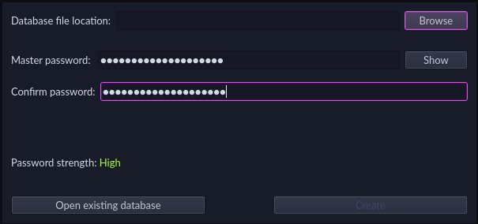
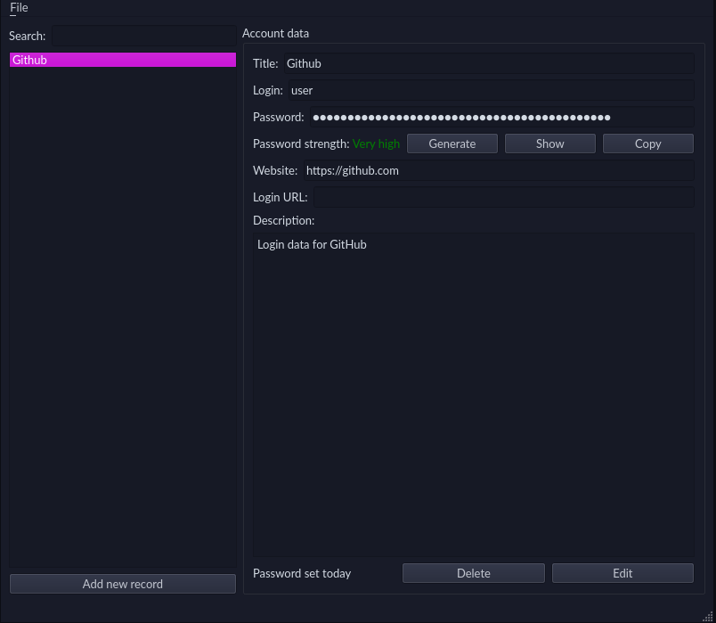
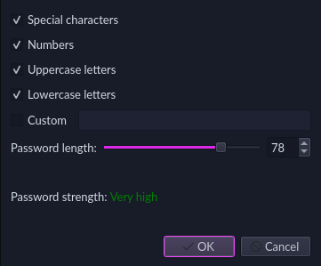
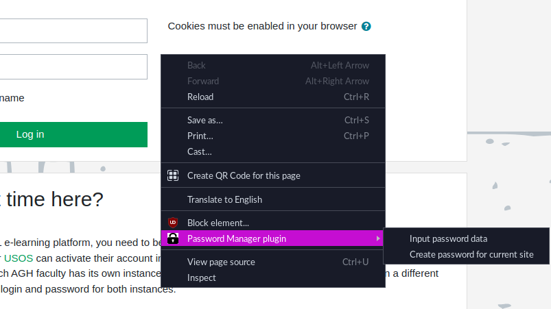

# Password Manager
A password-keeping application written in Python/Qt with a Chromium extension.

## Desktop application
It stores all data locally in a single  encrypted `.pmdb` file, secured by a master
password (PBKDF2, AES256).

## Extension
After loging to a local database file, an HTTPS server is run on localhost that allows for integration
with Chromium browser. It supports autofill of login/password and creating new entry with autogenerated
password for given site and username (password is generated based on desktop application settings).

## Tests
Application is covered by unit, integration and system (UI) tests.

The simplest way to run all of them is to execute `pytest .` in root directory.
